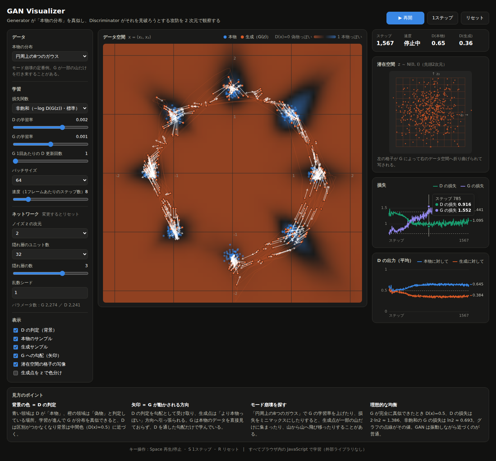

# ML Visualizer

AI のしくみを、ブラウザ上で動かしながら理解するためのローカルアプリです。
生成モデル（GAN・VAE・自己回帰 Transformer）と RAG を、それぞれ **たとえ話ガイド**（紙芝居形式）と **詳細**（自由にいじれる画面）の2枚で見られます。

ニューラルネットの順伝播・逆伝播・Adam、Transformer の注意機構、TF-IDF 検索まで、すべて素の JavaScript で書いてあります。
**npm install は不要**で、外部ライブラリにもサーバ側の計算にも依存しません。



## 起動

Node.js 18 以上が必要です。

```bash
cd ~/Developer/ml-visualizer
npm start            # = node server.js
```

ブラウザで http://localhost:8080 を開きます。ポートを変えたいときは `PORT=3000 npm start`（8080 が使用中なら空いている次のポートを自動で使います）。
Node が使えない環境では `cd public && python3 -m http.server 8080` でも動きます。

## ページ

| ページ | 内容 |
|---|---|
| ホーム | モデルの一覧 |
| GAN（ガイド / 詳細） | 偽札職人と警察の勝負。モード崩壊・勾配消失を再現できる |
| VAE（ガイド / 詳細） | 記憶して描き直す模写職人。潜在空間の楕円と β の綱引き、事後崩壊 |
| 自己回帰 Transformer | 点を4トークンに量子化して p(x) を学習。1トークンずつの生成とアテンション |
| RAG（ガイド / 詳細） | 図書館の司書と作家。検索 → プロンプト組み立て → 回答 |
| 比較 | 同じ分布を GAN・Transformer・VAE に同じステップ数で学習させ、品質と網羅性を並べる |
| 第0層の道具 | log・確率の掛け算・交差エントロピー・内積を、つまみを動かして体感する |
| 学習パス | 第0層（数学の道具）から実用までの順路。進捗と復習キューをブラウザに保存 |
| 用語と記号 | 用語を「意味・たとえ・記号・式」で引く辞典と、記号の読み方一覧 |
| ドリル | softmax・コサイン類似度・交差エントロピー・KL・GAN の損失を手計算する |

たとえ話ガイドには各ステップに「専門用語では」の対応表が付いています。はじめてのモデルはガイドから見るのがおすすめです。

## 学ぶための仕掛け

用語や式を「直感」とつなぐために、次を入れています。

- **第0層の道具**：式に出てくる道具そのものを動かせる専用ページ。−log p が「驚きの大きさ」として動き、確率の掛け算が対数の目盛りでまっすぐな線になり、softmax の棒が動き、矢印をドラッグするとコサイン類似度が変わります
- **用語カード**：本文中の点線つきの用語をクリックすると、意味・たとえ・記号・式・「アプリのどこで見られるか」が出ます
- **生きた数式（両方向）**：各モデルの詳細ページに、いま画面で動いている実際の数値が入った式があります。式の項にマウスを乗せると画面の対応箇所が光り、逆に<b>画面（凡例・数値・グラフ・キャンバス・つまみ）をクリックすると、式のどの項かが光ります</b>
- **予想クイズ**：ガイドの要所で、動かす前に予想を選びます。選択肢にはよくある勘違いを入れてあり、外したときは「選んだ答えが違う理由」が返ります。答えにあたる説明は、回答するまで伏せられます
- **ドリル**：小さい数字での手計算。数字は毎回変わるので、答えではなく手順が身につきます
- **自分の言葉で説明する**：各ガイドの最後に、キーワードを使って説明を書く欄があります。書くまで模範例は開けません（先に思い出す負荷をかけるため）。書いた文章はブラウザに残り、学習パスから進み具合が見られます
- **コード対応表**：各詳細ページの下に、このアプリの JavaScript と PyTorch の対応を並べています
- **学習パスと復習キュー**：16 ステップの順路。チェックを付けるとその用語が間隔反復の復習に入ります（1日 → 3日 → 7日 → 16日 → 35日）

## 各モデルの要点

### GAN

Generator（偽札職人）は本物を見られず、Discriminator（警察）の判定だけを頼りに学習します。背景は D(x)、矢印は勾配、薄い格子は潜在空間の写像です。
G の学習率を上げるとモード崩壊、損失をミニマックスにすると勾配消失が観察できます。

### VAE

エンコーダが点を「中心 μ と広がり σ のメモ」に変え、デコーダが z から描き直します。
潜在空間パネルでは各点が**楕円**として表示され、KL 項がそれを N(0, I) の円へそろえていく様子が見えます。
β を 0 にすると潜在空間が散らかり（ただのオートエンコーダ）、β を大きくすると事後崩壊（楕円が全部重なる）が起きます。

### 自己回帰 Transformer

各軸を 64 段階に区切り、1点を「x₁ 粗・x₂ 粗・x₁ 細・x₂ 細」の 4 トークン（語彙 8）で表します。
8³ = 512 通りの接頭辞を一度に流して全条件付き分布を表にし、64×64 マスの p(x)・祖先サンプリング・アテンションを表示します。

### RAG

架空の会社「みなと物流株式会社」の社内規程 24 件（内容はすべて架空）を対象に、質問 → 検索 → プロンプト組み立て → 回答の流れを見せます。

- 埋め込みの代わりに **文字 2-gram + TF-IDF**、近さは **コサイン類似度**
- 資料と質問の位置関係を、古典的 MDS で 2 次元の「地図」にして表示
- k・しきい値・チャンクの大きさ・語の重み・言い換えの有無を切り替えられる
- 資料にない質問（例：育児休業）では類似度が下がり、「記載がありません」と答える様子を確認できる
- この画面に LLM は入っていません。回答は「取り出した資料から関係の深い文を抜き出して並べたもの」です

### 比較

同じ分布・同じステップ数・同じバッチサイズで 3 つのモデルを学習させ、次を並べます。

- **品質（precision）**：生成点のうち本物の近くに落ちた割合
- **網羅性（recall）**：本物の点のうち生成点が近くにある割合
- **覆えている山**：混合ガウスで十分な数の点が落ちている山の数

指標は Kynkäänniemi et al. (2019) の改良版 Precision / Recall（k = 3）です。点を広くばらまくと網羅性だけ高く出るので、「覆えている山」と合わせて見てください。
なお 2 次元は自己回帰モデルに有利な舞台（全 4096 マスを数え上げられる）です。ここでの優劣が高次元でも同じとは限りません。

## 試してみると面白いこと

- **モード崩壊**：GAN で「円周上の8つのガウス」の G 学習率を 0.005〜0.01 に上げる
- **勾配消失**：GAN の損失を「ミニマックス」にして「渦巻き」を学習させる
- **事後崩壊**：VAE で β を 50〜150 にする。潜在空間の楕円が全部重なる
- **オートエンコーダ化**：VAE で β を 0 にする。復元は上手いのに生成が崩れる
- **GAN の「橋」**：比較ページの「5×5 格子のガウス」で、GAN の点が山と山のあいだに残る様子を見る
- **言い換えの壁**：RAG で「ChatGPT を仕事で使ってもいいですか？」を、言い換えあり / なしで比べる
- **チャンクの大きさ**：RAG で「条文ごと」と「文ごと」を切り替え、類似度と回答の変化を見る

## 構成

```
ml-visualizer/
├── server.js                  静的ファイルサーバ（Node 標準モジュールのみ）
├── package.json
├── public/
│   ├── index.html             ホーム
│   ├── math0.html             第0層の道具
│   ├── gan-guide.html / gan.html
│   ├── vae-guide.html / vae.html
│   ├── ar.html                自己回帰 Transformer
│   ├── rag-guide.html / rag.html
│   ├── compare.html           比較
│   ├── style.css              ライト / ダーク両対応
│   └── js/
│       ├── nn.js              MLP・逆伝播・Adam
│       ├── gan.js             G / D の交互学習
│       ├── vae.js             エンコーダ / デコーダ・再パラメータ化・KL
│       ├── transformer.js     デコーダ型 Transformer（因果的自己注意・LayerNorm）
│       ├── ar.js              トークン化・自己回帰の学習・確率表
│       ├── rag.js             2-gram・TF-IDF・コサイン類似度・MDS
│       ├── rag-corpus.js      架空の社内規程（題材）
│       ├── metrics.js         Precision / Recall、山の被覆数
│       ├── datasets.js        2次元のターゲット分布
│       ├── viz.js / ar-viz.js / vae-viz.js / rag-viz.js   描画
│       ├── math0-main.js      第0層の道具（log・確率の積・softmax・内積）
│       ├── glossary.js        用語データと用語カード
│       ├── curriculum.js      学習パスの内容
│       ├── formula.js         生きた数式
│       ├── drills.js          ドリルの問題（毎回生成）
│       ├── quiz.js            予想クイズ
│       ├── explain.js         自分の言葉で説明する欄
│       ├── progress.js        進捗と間隔反復（localStorage）
│       ├── code-snippets.js   JS と PyTorch の対応
│       ├── common.js          ページ共通（ヘッダー、履歴、用語カードの自動リンク）
│       └── *-main.js          各ページの状態管理と UI
└── test/
    ├── gan.test.js            MLP の勾配チェックと GAN の収束テスト
    ├── ar.test.js             Transformer の勾配チェックと学習テスト
    ├── vae.test.js            VAE の勾配チェック・学習・事後崩壊のテスト
    └── rag.test.js            検索の精度と地図の配置のテスト
```

テストは `npm test` で実行します。

## 実装メモ

**GAN**

- G: `z → [隠れ層 × depth, LeakyReLU] → x(2次元)`、D: `x → … → ロジット`
- Adam（β1 = 0.5, β2 = 0.999）。G は非飽和損失 `−log D(G(z))`（ミニマックス版も選べる）
- 勾配は D を通して G へ流すが、その際 D のパラメータは更新しない

**VAE**

- エンコーダ `x → (μ, logσ²)`、再パラメータ化 `z = μ + σ·ε`、デコーダ `z → x̂`
- 損失 `= 再構成誤差 / (2σₓ²) + β × KL(q(z|x) ‖ N(0, I))`、Adam（β1 = 0.9）
- p(x) の背景は、デコーダから z を 160 個引いた混合ガウスで近似

**自己回帰 Transformer**

- 入力 `[BOS, t₁, t₂, t₃]` → 予測 `[t₁, t₂, t₃, t₄]`（語彙 8・系列長 4）
- Pre-LN の `LayerNorm → 因果的マルチヘッド自己注意 → 残差 → LayerNorm → MLP → 残差`
- 損失は交差エントロピー（= 負の対数尤度）、Adam（β1 = 0.9, β2 = 0.99）

**RAG**

- 分かち書きの代わりに文字 2-gram（英数字は単語として保持）
- TF-IDF で重み付けし、コサイン類似度で検索。言い換えは小さな同義語表で代用
- 地図は類似度行列を二重中心化し、べき乗法で上位2成分を取る古典的 MDS

GAN・VAE・Transformer の逆伝播は、いずれも数値微分と一致することをテストで確認しています。
